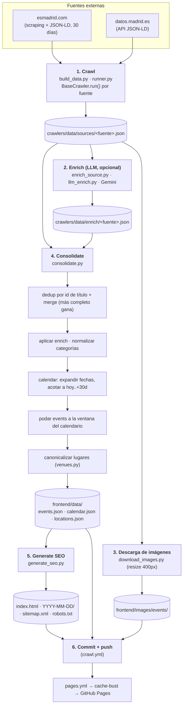

# Pipeline de datos

Cómo se generan los datos de Agenda Madrid, de las fuentes externas a los JSON
estáticos que consume el frontend. Todo se ejecuta a diario en GitHub Actions
(`crawl.yml`) y el resultado se commitea al repo.

Para los **comandos** concretos de cada fase, ver [`README.md`](README.md).
Este documento explica **cómo encaja todo**.

## Vista general

## Las fases

### 1. Crawl — `build_data.py`

`build_data.py` descubre los crawlers con `runner.discover_crawlers()`
(`pkgutil.iter_modules` sobre `crawlers/sources/`) y ejecuta `run()` de cada uno.

- **`esmadrid`** (`sources/esmadrid.py`): scrapea la búsqueda diaria de
  esmadrid.com **30 días** hacia delante y parsea el JSON-LD de cada ficha
  (en paralelo, `ThreadPoolExecutor(max_workers=10)`, `CRAWL_DELAY=1s`). Extrae
  además los horarios semanales (`schedule`).
- **`madrid_agenda`** (`sources/madrid_agenda.py`): descarga el JSON-LD de la
  API de datos.madrid.es (agenda de actividades). Rápido, sin scraping.

Cada crawler hereda de `BaseCrawler`. `run()` es **incremental**: carga el JSON
previo de la fuente, fusiona lo nuevo (expande rangos de fecha, casa stubs por
URL conocida) y guarda en `crawlers/data/sources/<fuente>.json`. A cada evento
se le asigna `id = sha256(title.strip().lower())[:16]` y se mapean las
categorías al set canónico de [`categories.py`](categories.py).

> Sin flag, `build_data.py` **solo crawlea**. La consolidación es un paso aparte
> (`--consolidate` o `crawlers.consolidate`).

### 2. Enrich con LLM (opcional) — `enrich_source.py`

Si hay `GEMINI_API_KEY`, mejora los datos con Gemini
(`gemini-3.1-flash-lite` y fallbacks). Rellena/mejora descripción, precio y
categorías; para `madrid_agenda` además **reescribe el título** (los originales
son de baja calidad). Modo `--batch` (por defecto en `madrid_agenda`) manda los
metadatos en lotes. El resultado se guarda en
`crawlers/data/enrich/<fuente>.json`, indexado por `id` de evento. Si no hay
API key, esta fase se salta y el pipeline sigue.

### 3. Descarga de imágenes — `download_images.py`

Descarga las imágenes remotas de todos los sources, las redimensiona a 400px de
ancho máximo (JPEG) y las guarda en `frontend/images/events/`.

### 4. Consolidate — `consolidate.py`

El corazón del pipeline. No toca ninguna API externa:

1. **Carga** todos los `sources/*.json` y `enrich/*.json`.
2. **Deduplica por `id`** (= hash del título original) y fusiona con
   `merge_event` (gana el registro más completo según `richness()`; se combinan
   fuentes y horarios).
3. **Aplica el enrich** (`_apply_enrich`): el LLM gana en descripción, precio y
   categorías; el título solo en `madrid_agenda`; rellena huecos de ubicación;
   **nunca toca las fechas** (esas vienen solo del scraper).
4. **Normaliza categorías**, infiere la categoría padre desde los tags y quita
   "otros" redundante.
5. **Genera `calendar.json`**: expande el rango `start_date..end_date` de cada
   evento día a día, respetando el `schedule` semanal, y lo **acota a la ventana
   `[hoy, hoy+30 días]`**.
6. **Poda `events`**: solo se conservan los eventos con al menos una entrada en
   el calendario (si no, `events.json` acumularía eventos pasados para siempre).
7. **Canonicaliza los lugares** ([`venues.py`](venues.py)): agrupa las variantes
   del mismo sitio (nombre normalizado o coordenadas cercanas, fusión a nivel de
   edificio) y construye `locations.json`. Cada evento referencia su lugar por
   `lid`.

Al final llama a `generate_seo()`.

### 5. Generate SEO — `generate_seo.py`

- Resuelve `lid → locations.json` para reincorporar el lugar a cada evento.
- Inyecta el JSON-LD y el prerender del **día de hoy** en `index.html` (entre
  marcadores `SEO:JSON_LD` / `SEO:PRERENDER`).
- Genera una **página por fecha** `frontend/YYYY-MM-DD/index.html` (30 días) con
  JSON-LD, prerender y etiquetas `canonical`/`og`. Limpia las carpetas de fechas
  fuera de la ventana.
- Genera `sitemap.xml` y `robots.txt`.

### 6. Commit + push

`crawl.yml` commitea los sources, enrich, `frontend/data/`, imágenes y las
páginas SEO, y hace push. El push dispara `pages.yml`.

## Modelo de deduplicación

La identidad de un evento es `sha256(título)[:16]`, calculada **antes** de
enriquecer. Esto solo fusiona títulos idénticos, así que el mismo evento que
llega de dos fuentes con títulos distintos (o de datos.madrid con el nombre del
intérprete delante) queda como dos registros. La **canonicalización de lugares**
(fase 4.7) da una señal de "mismo sitio" exacta (`lid`) para detectar esos
duplicados; el dedup cross-source que la usa está pendiente.

## Artefactos generados

| Artefacto | Generado por | ¿En git? | Contenido |
|---|---|---|---|
| `crawlers/data/sources/*.json` | Crawl | Sí | Datos crudos por fuente (con fechas) |
| `crawlers/data/enrich/*.json` | Enrich | Sí | Mejoras del LLM por `id` |
| `frontend/images/events/` | Descarga imágenes | Sí | Thumbnails 400px |
| `frontend/data/events.json` | Consolidate | Sí | Eventos únicos (id → evento, sin fechas, con `lid`) |
| `frontend/data/calendar.json` | Consolidate | Sí | fecha → refs a eventos con horarios |
| `frontend/data/locations.json` | Consolidate | Sí | `lid` → lugar (nombre, coords, distrito) |
| `frontend/index.html`, `YYYY-MM-DD/`, `sitemap.xml`, `robots.txt` | SEO | Sí | Páginas pre-renderizadas + JSON-LD |

## Integración con CI

- **`crawl.yml`** — diario a las **6:00 UTC** (y `workflow_dispatch` manual):
  checkout → Python 3.12 → instalar deps → `build_data.py` (fase 1) → enrich si
  hay `GEMINI_API_KEY` (fase 2) → `download_images` (fase 3) → `consolidate`
  (fases 4-5) → commit + push (fase 6).
- **`pages.yml`** — en cada push a `main`: cache-busting (hash del commit en
  `style.css`/`app.js`) y deploy a GitHub Pages.

## Añadir una fuente nueva

1. Crear `crawlers/sources/<fuente>.py` con una clase que herede de
   `BaseCrawler`, con `name` y `crawl()` (devuelve lista de dicts de evento).
2. El runner la descubre sola. Cada evento necesita al menos `title`,
   `start_date`, `source` y `categories` (mapeadas al set canónico).
